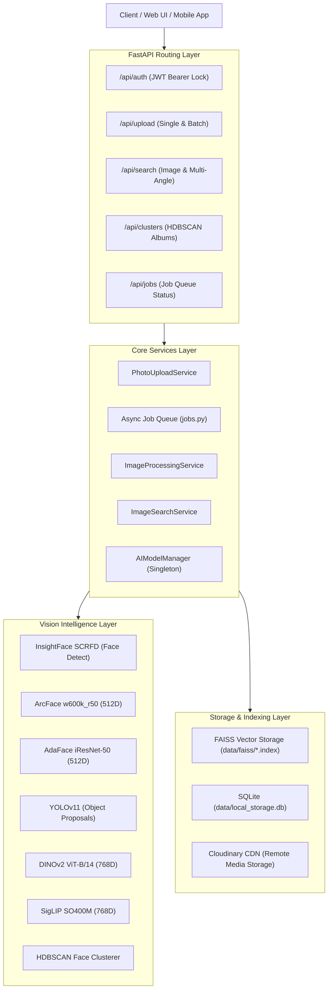

# Visual Search API

> High-performance, multimodal visual intelligence and face recognition engine powered by **InsightFace (ArcFace)**, **AdaFace**, **YOLOv11**, **DINOv2**, **SigLIP**, and local **FAISS** vector storage.

[](https://www.python.org/)
[](https://fastapi.tiangolo.com/)
[](https://github.com/facebookresearch/faiss)
[](LICENSE)

---

## 📖 Deep-Dive Architecture & Context Documentation

Comprehensive architectural blueprints and technical references are maintained in the [`context/`](context/) folder:

| Documentation File | Topic & Details Covered |
| :--- | :--- |
| [**01_architecture.md**](context/01_architecture.md) | High-level system architecture diagram, layered hexagonal design, component dependencies. |
| [**02_system_flow_and_working.md**](context/02_system_flow_and_working.md) | Step-by-step lifecycle flows for single ingest, batch upload, face clustering, and multi-angle search. |
| [**03_why_what_how_decisions.md**](context/03_why_what_how_decisions.md) | Technical rationale: Why local FAISS over SaaS vector DBs, SQLite over heavy databases, HDBSCAN vs K-Means. |
| [**04_ai_models_and_embeddings.md**](context/04_ai_models_and_embeddings.md) | AI models breakdown (InsightFace SCRFD + ArcFace, AdaFace, YOLOv11, DINOv2, SigLIP, HDBSCAN), embedding math. |
| [**05_upload_concurrency_and_jobs.md**](context/05_upload_concurrency_and_jobs.md) | Threading model, asyncio concurrency semaphores, background job queue, parallel Cloudinary/AI execution. |
| [**06_processing_and_indexing.md**](context/06_processing_and_indexing.md) | Image preprocessing, quality validation, FAISS index structures, dual indexing, metadata sync, Cloudinary URLs. |
| [**07_production_saas_scale_plan.md**](context/07_production_saas_scale_plan.md) | Enterprise scale roadmap: PostgreSQL RLS multi-tenancy, Triton/TensorRT AI decoupling, FAISS HNSW/IVF-PQ, distributed workers. |

---

## ⚡ Key Capabilities

- **Sub-2ms Visual Search**: Executes cosine similarity search locally on CPU via FAISS `IndexFlatIP` without external vector cloud latency or API costs.
- **Dual-Model Face Scoring**: Combines **ArcFace** (angular discriminative margin) and **AdaFace** (adaptive image-quality margin) into a composite similarity score ($0.60 \cdot \text{ArcFace} + 0.40 \cdot \text{AdaFace}$) to maximize recall under challenging lighting and blur.
- **Multi-Angle Composite Search**: Fuses Frontal, Left Profile, and Right Profile face images into a single composite representation for robust multi-pose gallery matching.
- **Automated Zero-Shot Fallback**: If an image contains no human faces, the pipeline automatically routes to **DINOv2 (ViT-B/14) + SigLIP (SO400M)** 1536D fused vectors for object and scene search.
- **Unsupervised Face Identity Clustering (HDBSCAN)**: Automatically clusters unlabelled photos into people albums, excludes outlier noise (`-1`), and identifies the optimal representative **medoid photo** with Cloudinary CDN delivery.
- **Asynchronous Background Queue**: Ingestion of large image batches is queued asynchronously with real-time log polling, concurrency semaphores, and worker state machines.
- **Zero Heavy External Dependencies**: No external Redis or Pinecone required. Everything persists locally in SQLite and native FAISS indexes, with Cloudinary CDN integration for media hosting.

---

## 🏗️ System Architecture Overview



---

## 🚀 Quick Start Guide

### 1. Run with Docker (Recommended)

```bash
# 1. Clone repository
git clone https://github.com/your-username/visual-search-api.git
cd visual-search-api

# 2. Build Docker container
docker build -t visual-search-api .

# 3. Launch container on port 7860
docker run -d --name visual_search_api -p 7860:7860 visual-search-api

# 4. View container logs
docker logs -f visual_search_api
```

Interactive Swagger API docs will be available at: **`http://localhost:7860/docs`**

---

### 2. Local Environment Setup

```bash
# Create and activate virtual environment
python3 -m venv venv
source venv/bin/activate

# Install dependencies
pip install -r requirements.txt

# Start API server
uvicorn main:app --host 0.0.0.0 --port 7860 --reload
```

---

## 🔑 Environment Configuration (`.env`)

```ini
# Server Concurrency & Threads
OMP_NUM_THREADS=2
MKL_NUM_THREADS=2
TOKENIZERS_PARALLELISM=false
MAX_CONCURRENT_INFERENCES=2

# Cloudinary CDN Credentials
CLOUDINARY_URL=cloudinary://<api_key>:<api_secret>@<cloud_name>

# Local Storage Paths
SQLITE_DB_PATH=data/local_storage.db
FAISS_DATA_DIR=data/faiss

# JWT Secret Key
JWT_SECRET_KEY=your-secure-jwt-secret-key-32-chars
```

---

## 📡 API Reference & Examples

### 1. Authenticate & Obtain JWT Token
```bash
curl -X POST "http://localhost:7860/api/auth/token" \
  -H "Content-Type: application/x-www-form-urlencoded" \
  -d "username=admin&password=password123"
```

### 2. Visual Search (Single Query Image)
```bash
curl -X POST "http://localhost:7860/api/search/image?folder_name=general&threshold=0.35&top_k=10" \
  -H "Authorization: Bearer <TOKEN>" \
  -F "file=@query_photo.jpg"
```

### 3. Multi-Angle Composite Face Search
```bash
curl -X POST "http://localhost:7860/api/search/multi-angle?folder_name=general&threshold=0.40" \
  -H "Authorization: Bearer <TOKEN>" \
  -F "front_file=@frontal_face.jpg" \
  -F "left_file=@left_profile.jpg" \
  -F "right_file=@right_profile.jpg"
```

### 4. Trigger Face Identity Clustering (Generate People Albums)
```bash
curl -X POST "http://localhost:7860/api/clusters/generate?folder_name=general&min_cluster_size=3" \
  -H "Authorization: Bearer <TOKEN>"
```

### 5. Inspect Identified Face Clusters & Medoids
```bash
curl -X GET "http://localhost:7860/api/clusters?folder_name=general" \
  -H "Authorization: Bearer <TOKEN>"
```

---

## 🧪 Running Automated Tests

The test suite runs in full isolation with separate temporary databases in `/tmp`:

```bash
docker exec -e PYTHONPATH=/app visual_search_api pytest tests/unit/
```

---

## 📄 License

This project is licensed under the MIT License. See [LICENSE](LICENSE) for details.