# System Architecture

The **Visual Search API** is an enterprise-grade, microservices-style visual intelligence system designed for multimodal visual search, biometric identity resolution, and automated face clustering albums.

It is built on modern Python 3.10+ async patterns, FastAPI, local high-performance FAISS vector storage, and an ensemble of state-of-the-art vision models (InsightFace, AdaFace, YOLOv11, DINOv2, SigLIP).

---

## High-Level Architecture Diagram

```mermaid
flowchart TD
    Client["Client / Frontend / Swagger UI"]
    
    subgraph APILayer ["FastAPI Routing Layer (/src/api)"]
        AuthRoute["auth_routes.py<br/>(JWT & Credentials)"]
        UploadRoute["upload_routes.py<br/>(Single & Batch Ingest)"]
        ProcessRoute["processing_routes.py<br/>(Clustering & Inference)"]
        SearchRoute["search_routes.py<br/>(Image & Multi-Angle Search)"]
        SysRoute["system_routes.py & ui.py<br/>(Health & Diagnostics)"]
    end

    subgraph ServiceLayer ["Service Orchestration Layer (/src/services)"]
        AuthSvc["UserAuthService"]
        UploadSvc["PhotoUploadService"]
        JobMgr["Async Job Queue & Worker<br/>(jobs.py)"]
        ProcSvc["ImageProcessingService"]
        SearchSvc["ImageSearchService"]
        AIMgr["AIModelManager<br/>(Singleton in app.state)"]
    end

    subgraph CoreVision ["Vision & Clustering Modules (/src/modules)"]
        FaceDet["face_detector.py<br/>(SCRFD 10G)"]
        FaceEmb["face_embedder.py<br/>(ArcFace 512D + AdaFace 512D)"]
        ObjEmb["object_embedder.py<br/>(DINOv2 + SigLIP 1536D)"]
        ClusterMod["hdbscan_clusterer.py<br/>(HDBSCAN & Medoid Finder)"]
        ScorerMod["vector_scorer.py & angle_fuser.py<br/>(Cosine Score Fusion)"]
    end

    subgraph StorageLayer ["Persistence & Storage Layer (/src/modules)"]
        FAISSEngine["FAISSEngine<br/>(data/faiss/*.index)<br/>IndexFlatIP + IndexIDMap2"]
        SQLiteRepo["SQLite Repository<br/>(data/local_storage.db)<br/>Users, Jobs, Metadata, Clusters"]
        CloudStorage["Cloudinary CDN Client<br/>(cloudinary_storage.py)"]
        LocalDisk["Local Disk Cache<br/>(saved_images/)"]
    end

    Client -->|HTTP / Bearer JWT| APILayer
    APILayer --> ServiceLayer
    ServiceLayer --> CoreVision
    ServiceLayer --> StorageLayer
    CoreVision --> StorageLayer
```

---

## Architectural Principles

The application adheres strictly to **Clean Architecture / Hexagonal Architecture** principles:

1. **Decoupled API Boundaries**:
   - Routers in `src/api/` do not execute business logic or database queries directly.
   - All operations are injected via FastAPI `Depends()` providers defined in [`src/api/dependencies.py`](file:///home/sudhanshu/Desktop/visual-search-api/src/api/dependencies.py).
   - This ensures routes are easily testable and mockable.

2. **Domain Service Orchestration**:
   - High-level business flows are contained in `src/services/`:
     - [`user_auth_service.py`](file:///home/sudhanshu/Desktop/visual-search-api/src/services/user_auth_service.py): Authentication, password hashing, and user credential tracking.
     - [`photo_upload_service.py`](file:///home/sudhanshu/Desktop/visual-search-api/src/services/photo_upload_service.py): Photo validation, disk staging, and Cloudinary upload.
     - [`image_processing_service.py`](file:///home/sudhanshu/Desktop/visual-search-api/src/services/image_processing_service.py): Feature extraction, indexing, and HDBSCAN clustering.
     - [`image_search_service.py`](file:///home/sudhanshu/Desktop/visual-search-api/src/services/image_search_service.py): Multimodal similarity scoring and multi-angle composite search.
     - [`jobs.py`](file:///home/sudhanshu/Desktop/visual-search-api/src/services/jobs.py): Non-blocking asynchronous ingestion queue with worker loops and state persistence.

3. **Domain Modules**:
   - `src/modules/vision/`: Model wrappers for detection and embedding extraction.
   - `src/modules/clustering/`: Pure clustering mathematics, distance metrics, and medoid calculation.
   - `src/modules/search/`: Vector score fusion, angle fusion, and threshold filtering.
   - `src/modules/infra/`: Local FAISS vector engine and SQLite repository.
   - `src/modules/storage/`: Cloudinary CDN integration and local image filesystem management.

4. **Zero External Vector Cloud Dependencies**:
   - External hosted vector databases (like Pinecone) are completely eliminated.
   - High-speed FAISS vector storage executes directly on the CPU with native C++ SIMD vector instructions, keeping operational latency under 2 milliseconds and eliminating external API failure points.

