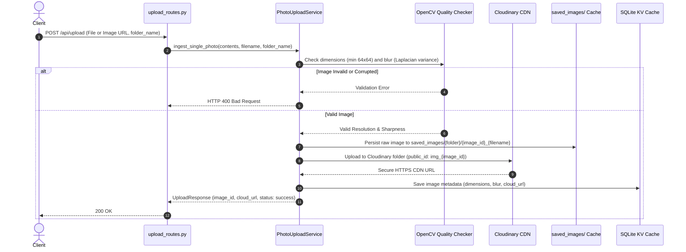
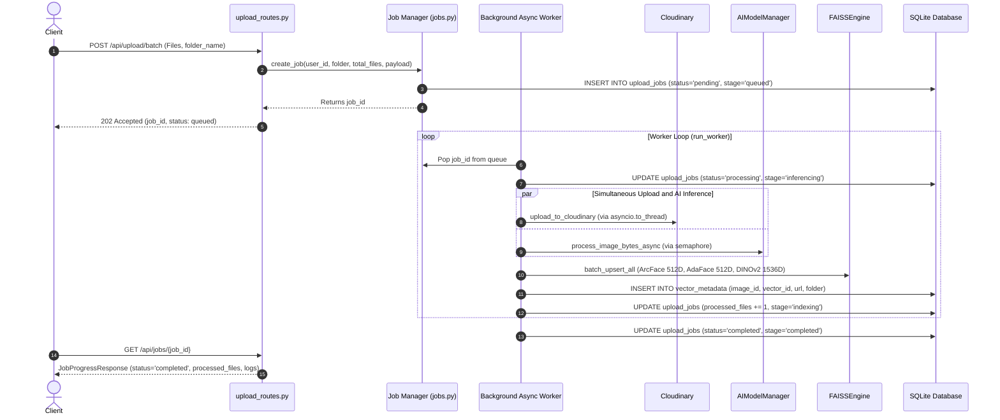
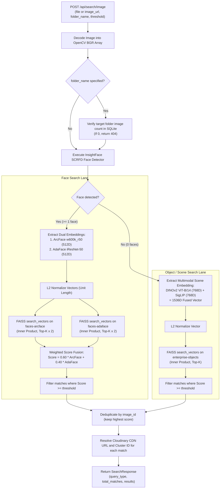

# System Flow & Working

This document details the lifecycle of every core user operation in the **Visual Search API**: Single Photo Ingestion, Batch Upload via Background Job Queue, Face Identity Clustering, Single-Image Search, and Multi-Angle Composite Face Search.

---

## 1. Single Photo Upload & Ingestion Flow

When a user uploads a single image via `POST /api/upload`:

---

## 2. Asynchronous Batch Upload & Background Job Queue

For high-volume photo uploads (e.g., zip files or dozens of images), the API decouples network ingestion from model inference using a background job queue:

---

## 3. Visual Search Pipeline (Single Query Image)

When a query image is submitted to `POST /api/search/image`:

---

## 4. Multi-Angle Composite Face Search Pipeline

Real-world security and enterprise gallery applications often encounter severe pose variations (profiles, head tilts). The endpoint `POST /api/search/multi-angle` solves this via **perspective fusion**:

1. **Input Submission**: Accepts up to three perspective images of the same individual:
   - Frontal face (`front_file` or `front_url`)
   - Left profile (`left_file` or `left_url`)
   - Right profile (`right_file` or `right_url`)
2. **Feature Extraction**:
   - For each provided angle, faces are detected and extracted into ArcFace 512D and AdaFace 512D vectors.
3. **Adaptive Angle Weighting**:
   - `fuse_angle_embeddings` combines vectors with optimal perspective weighting:
     $$\mathbf{v}_{\text{composite}} = 0.50 \cdot \mathbf{v}_{\text{front}} + 0.25 \cdot \mathbf{v}_{\text{left}} + 0.25 \cdot \mathbf{v}_{\text{right}}$$
   - If only front and one side angle are provided, weights automatically re-normalize (e.g. 65% front, 35% side).
4. **Vector Normalization**: The resulting composite vector is L2-normalized:
   $$\hat{\mathbf{v}} = \frac{\mathbf{v}_{\text{composite}}}{\|\mathbf{v}_{\text{composite}}\|_2}$$
5. **FAISS Query**: The composite vector searches the gallery, successfully retrieving targets regardless of whether stored gallery photos captured frontal or side angles.

---

## 5. Automated Face Identity Clustering (HDBSCAN)

To create people albums from thousands of unlabeled photos:

1. **Vector Retrieval**: All face vectors indexed in a target folder (or globally) are reconstructed from FAISS `faces-arcface` (512D).
2. **HDBSCAN Clustering**:
   - Density-based clustering groups vectors without requiring the number of identities ($k$) to be predefined.
   - Vectors that do not confidently belong to any dense identity cluster are marked as noise (`-1`) to avoid false identity merges.
3. **Cluster Medoid Selection**:
   - For each discovered identity cluster, the algorithm computes the pairwise cosine distance matrix between all member faces:
     $$\text{medoid} = \arg\min_{i} \sum_{j} (1 - \mathbf{v}_i \cdot \mathbf{v}_j)$$
   - The face closest to the geometric center becomes the representative **medoid photo**.
4. **Persistence**:
   - Clusters are stored in SQLite `face_clusters` with `cluster_id`, `person_name`, `face_count`, and `medoid_cloudinary_url`.
   - Vector mappings are saved in `face_vector_clusters` for immediate lookup by `image_id`.

