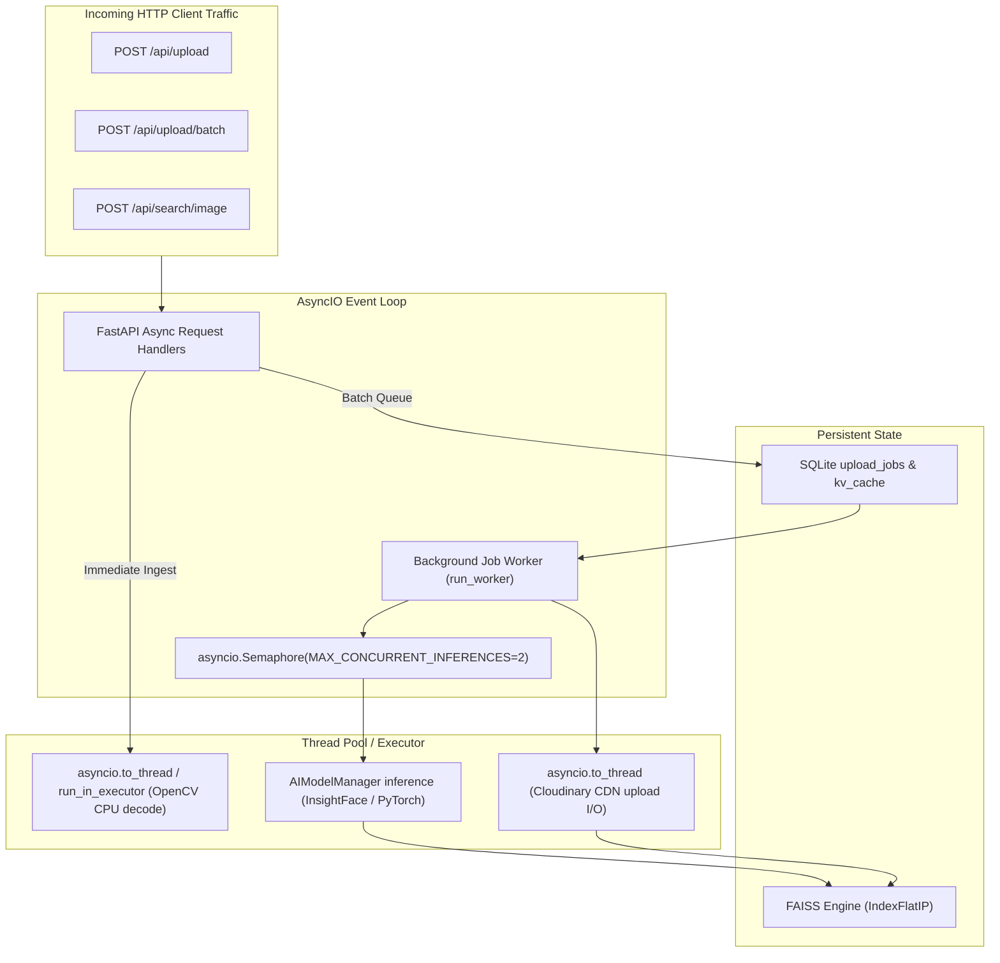
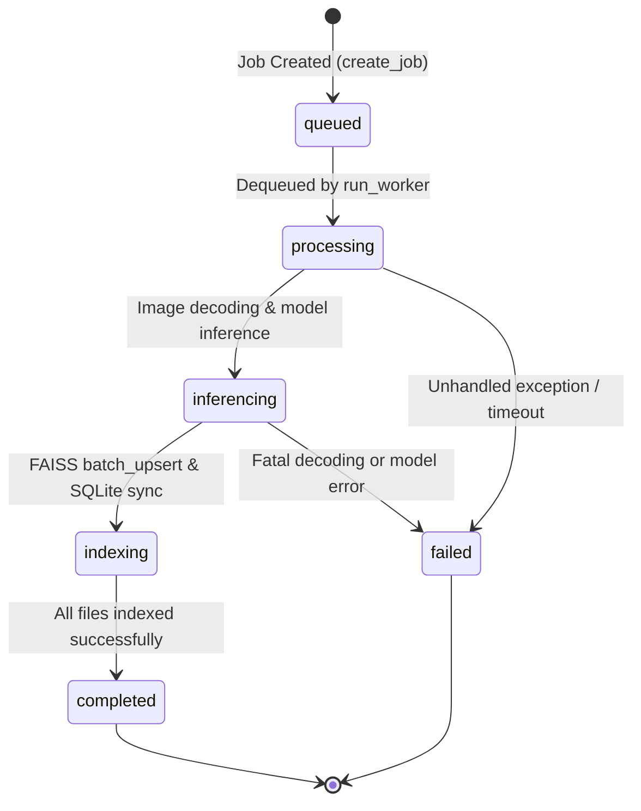

# Upload Concurrency, Threading & Job Management

This document explains how asynchronous background upload jobs, worker threads, semaphores, and concurrency limits are engineered in [`src/services/jobs.py`](file:///home/sudhanshu/Desktop/visual-search-api/src/services/jobs.py) and [`src/services/photo_upload_service.py`](file:///home/sudhanshu/Desktop/visual-search-api/src/services/photo_upload_service.py).

---

## 1. Concurrency Architecture & Threading Model

Deep learning inference (ONNX Runtime, PyTorch) is computationally heavy and CPU-intensive. If unconstrained, concurrent HTTP requests could spawn multiple parallel inferences simultaneously, starving the event loop and freezing the server.

The application implements a multi-tier concurrency control strategy:



---

## 2. Semaphore Concurrency Limiter

The application state instantiates an `asyncio.Semaphore`:
```python
# main.py
MAX_CONCURRENT_INFERENCES = int(os.getenv("MAX_CONCURRENT_INFERENCES", "2"))
app.state.ai_semaphore = asyncio.Semaphore(MAX_CONCURRENT_INFERENCES)
```

### Why Semaphores Are Critical
- In pure async Python, `async def` functions run cooperatively on a single thread. When calling C-extensions (like ONNX Runtime or Torch C++ inference), execution blocks the GIL if not offloaded.
- By wrapping AI inference in `async with sem:`, at most 2 model inferences can execute concurrently across all active requests.
- Additional requests queue gracefully on the semaphore without CPU throttling or thread starvation.

---

## 3. Parallel Dual-Pipeline Execution (`asyncio.gather`)

In [`src/services/jobs.py`](file:///home/sudhanshu/Desktop/visual-search-api/src/services/jobs.py#L241-L251), each file in a batch upload executes Cloudinary network I/O and local AI inference **simultaneously**:

```python
async def process_one_file(*, file_bytes, folder, detect_faces, keys, ai, sem):
    file_id = uuid.uuid4().hex

    async def _run_ai():
        async with sem:
            return await ai.process_image_bytes_async(file_bytes, detect_faces=detect_faces)

    # Offload network blocking upload to a worker thread
    cld_task = asyncio.to_thread(
        upload_to_cloudinary, io.BytesIO(file_bytes), folder, keys.get("cloudinary_creds", {})
    )
    
    # Run AI inference controlled by the semaphore
    ai_task = _run_ai()

    # Both execute in parallel!
    cld_res, vectors = await asyncio.gather(cld_task, ai_task)
    return file_id, cld_res.get("secure_url", ""), vectors
```

### Performance Impact
- Network latency for uploading a 5MB photo to Cloudinary: ~300ms–800ms.
- AI inference for face detection and embedding: ~200ms–500ms.
- Sequential execution: ~500ms–1300ms per photo.
- **Parallel execution via `asyncio.gather`**: Max(Network, AI) = **~300ms–800ms per photo (2x throughput boost)**.

---

## 4. Background Job Queue State Machine

The job management system operates without external Redis or Celery dependencies:



### State Definitions
1. **`pending` / `queued`**:
   - The job has been received, given a unique UUID `job_id`, written to SQLite `upload_jobs`, and pushed to the FIFO queue (`lpush`).
   - The client receives an immediate `202 Accepted` response with the `job_id`.
2. **`processing`**:
   - The background worker (`run_worker`) popped the `job_id` from the queue (`rpop`).
   - Stages include `validating`, `inferencing`, and `indexing`.
3. **`completed`**:
   - All files have been uploaded to Cloudinary, indexed in FAISS, and committed to SQLite metadata.
   - Summary statistics (`total_files`, `processed_files`, `results`) are sealed.
4. **`failed`**:
   - Any fatal error is caught, formatted into `error_message`, and logged with timestamp.

---

## 5. Live Progress Polling & Job Inspection

Clients track execution progress in real-time via `GET /api/jobs/{job_id}`:

```json
{
  "job_id": "9b1deb4d-3b7d-4bad-9bdd-2b0d7b3dcb6d",
  "status": "processing",
  "total_files": 50,
  "processed_files": 34,
  "current_stage": "indexing",
  "logs": [
    "[14:30:01] Job queued: 50 images scheduled for folder 'vacation'",
    "[14:30:02] Worker dequeued job 9b1deb4d-3b7d-4bad-9bdd-2b0d7b3dcb6d",
    "[14:30:15] Processed 34/50 photos (Cloudinary uploaded & FAISS indexed)"
  ],
  "created_at": "2026-10-08T14:30:01Z",
  "updated_at": "2026-10-08T14:30:15Z"
}
```
Fast-path status checks read from in-memory cache with fallback to SQLite `upload_jobs`.

