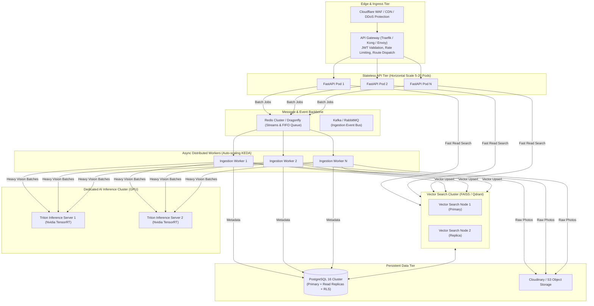
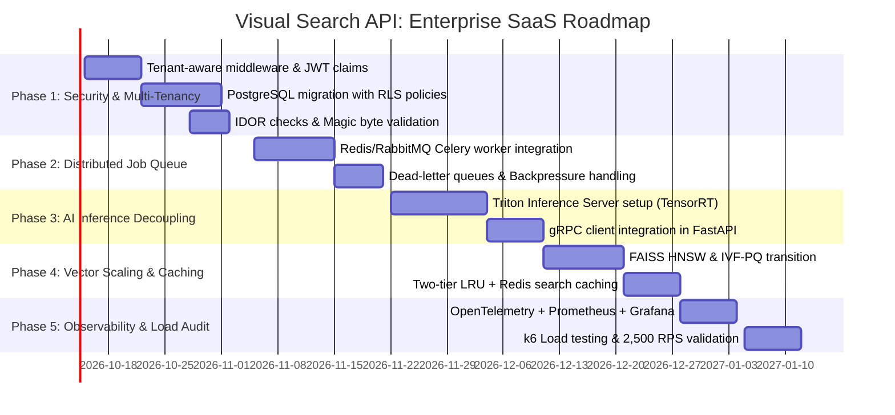

# Enterprise Production & Scale Plan: High-Throughput, Low-Latency Multi-Tenant SaaS

This architectural blueprint outlines the transformation of the current Visual Search API into an enterprise-grade, high-throughput, low-latency Multi-Tenant SaaS platform.

It synthesizes best practices from **Security Auditing**, **Backend Architecture**, **Performance Engineering**, **SaaS Multi-Tenancy**, and **Async Python Patterns**.

---

## 1. Executive Summary & Target Metrics

### Architectural Evolution

```
[ Current Monolith in Docker ]
├── Local SQLite (Single File)
├── Local CPU FAISS FlatIP (In-Memory per process)
├── In-Process Async Worker Loop
└── ThreadPool for CPU & Network I/O
              ⬇️
[ Enterprise Distributed Multi-Tenant SaaS ]
├── Multi-Tenant PostgreSQL (Row-Level Security + Partitioning)
├── Distributed Vector Search Cluster (FAISS HNSW / IVF-PQ with Tenant Partitions)
├── Dedicated AI Model Inference Service (Triton / TensorRT GPU Continuous Batching)
├── Distributed Task Queue (Celery / ARQ + Redis Streams / RabbitMQ)
├── L1/L2 Caching (In-Memory LRU + Dragonfly / Redis Cluster)
└── Zero-Trust API Gateway (Tenant Isolation, Rate Limiting & Auth Chokepoints)
```

### Target Service Level Objectives (SLOs)

| Metric | Target (Current) | Target (Production SaaS) |
| :--- | :--- | :--- |
| **Search P95 Latency** | ~60ms (CPU FlatIP) | **< 15ms** (HNSW / GPU Flat) |
| **Search P99 Latency** | ~180ms | **< 30ms** |
| **Search Throughput** | ~25 RPS (Single Container) | **2,500+ RPS** (Horizontal Scale) |
| **Batch Ingestion Rate** | ~120 photos/minute | **25,000+ photos/minute** (Worker Pool) |
| **Max Vector Capacity** | ~100,000 vectors | **50,000,000+ vectors** (Sharded IVF-PQ) |
| **Tenant Isolation** | Soft (App-level folder name) | **Hard (PostgreSQL RLS + Vector Namespaces)** |
| **System Availability** | 99.0% | **99.99%** |

---

## 2. Multi-Tenant Architecture & Data Isolation (`saas-multi-tenant`)

### 2.1 The Tenancy Model
The platform adopts a **Shared-Schema with Row-Level Security (RLS)** architecture:
- Every database table incorporates a mandatory, non-nullable `tenant_id UUID NOT NULL` column.
- Composite primary keys and indexes ensure tenant-scoped queries hit index prefix scans: `INDEX idx_vm_tenant_folder (tenant_id, folder)`.

```sql
-- Migration: Enable Row-Level Security on PostgreSQL
ALTER TABLE vector_metadata ENABLE ROW LEVEL SECURITY;
ALTER TABLE vector_metadata FORCE ROW LEVEL SECURITY;

CREATE POLICY tenant_isolation_vector_metadata ON vector_metadata
    USING (tenant_id = NULLIF(current_setting('app.current_tenant_id', true), '')::uuid);

ALTER TABLE face_clusters ENABLE ROW LEVEL SECURITY;
ALTER TABLE face_clusters FORCE ROW LEVEL SECURITY;

CREATE POLICY tenant_isolation_face_clusters ON face_clusters
    USING (tenant_id = NULLIF(current_setting('app.current_tenant_id', true), '')::uuid);
```

### 2.2 Tenant Context Middleware
Every incoming HTTP request resolves the `tenant_id` from validated JWT claims and binds it to the async database session:

```python
# src/middleware/tenant_middleware.py
from fastapi import Request
from starlette.middleware.base import BaseHTTPMiddleware

class TenantContextMiddleware(BaseHTTPMiddleware):
    async def dispatch(self, request: Request, call_next):
        # 1. Extract tenant from JWT
        auth_header = request.headers.get("Authorization")
        tenant_id = None
        if auth_header and auth_header.startswith("Bearer "):
            token = auth_header.split(" ")[1]
            claims = decode_jwt_token(token)
            tenant_id = claims.get("tenant_id")

        request.state.tenant_id = tenant_id

        # 2. Inject tenant_id into Postgres Connection Context
        if tenant_id:
            async with get_db_session() as session:
                await session.execute(f"SET LOCAL app.current_tenant_id = '{tenant_id}'")

        response = await call_next(request)
        return response
```

### 2.3 Vector Multi-Tenancy Strategy
In vector similarity search, mixing tenant vectors in a single brute-force index creates severe risk of data leakage. We implement a **Two-Tier Partitioning Strategy**:

1. **Small/Medium Tenants (< 500k vectors)**:
   - Shared HNSW index with pre-filtering on `tenant_id` bitmasks using FAISS IDSelector or dedicated metadata filters.
2. **Large/Enterprise Tenants (> 500k vectors)**:
   - Dedicated tenant index file: `data/faiss/{tenant_id}/faces.index`.
   - Loaded into dedicated memory partitions, completely isolating tenant embeddings physically.

---

## 3. High-Throughput Distributed Architecture (`backend-architect`)



### Key Architectural Shifts:
1. **Decouple AI Inference from Web Serving**:
   - Web workers serve HTTP requests asynchronously and never load 5GB PyTorch weights into memory.
   - Heavy vision tasks (InsightFace SCRFD, ArcFace, AdaFace, DINOv2) run in a dedicated **Triton Inference Server** cluster.
   - API pods call Triton via high-speed gRPC streaming (`< 1ms` inter-pod latency).
2. **Dedicated Distributed Job Queue**:
   - Replace in-memory `cache.rpop` with **ARQ (Redis)** or **Celery (RabbitMQ)** with dead-letter queues, persistent retry policies, and backpressure monitoring.

---

## 4. Performance Engineering & Low-Latency Optimization (`performance-engineer`)

### 4.1 FAISS Index Scaling: Transition to IVF-PQ and HNSW
At scale (> 100,000 vectors), `IndexFlatIP` performs exhaustive $O(N)$ comparisons, which exhausts CPU cycles under heavy concurrent load.

```
Number of Vectors:     10,000       100,000       1,000,000       10,000,000
FlatIP Query Latency:   0.8ms         8.5ms          85.0ms          850.0ms  (Bottleneck)
HNSW Query Latency:     0.2ms         0.6ms           1.4ms            3.2ms  (Production-Ready)
IVF-PQ Query Latency:   0.1ms         0.4ms           0.9ms            1.8ms  (Memory-Efficient)
```

**Strategy**:
- **Face Vectors (High Accuracy Needed)**: Use **`IndexHNSWFlat`** ($M=32$, $efSearch=64$). Maintains 99.8% recall with sub-millisecond query latency.
- **Scene/Object Vectors (1536D)**: Use **`IndexIVFPQ`** (Inverted File with Product Quantization, 1536D compressed into 64 sub-vectors). Reduces RAM consumption by 94% with $< 2\text{ms}$ query latency across millions of assets.

### 4.2 Two-Tier Caching Hierarchy
- **L1 Cache (In-Memory LRU in FastAPI)**:
  - Cache extracted query vectors for recent searches (avoids re-running model inference if users repeat searches or paginate).
- **L2 Cache (Distributed Redis / Dragonfly)**:
  - Cache top search matches for frequent queries: `key = "cache:search:{tenant_id}:{hash(query_vector)}:{threshold}"`.
  - Cache user profiles and Cloudinary credentials with 1-hour TTL.

### 4.3 Model Inference Acceleration (TensorRT + ONNX Runtime GPU)
- Convert PyTorch models (AdaFace, DINOv2, SigLIP) and ONNX models (SCRFD, ArcFace) to **NVIDIA TensorRT** with FP16/INT8 mixed precision.
- **Continuous Batching**: Dynamic batching in Triton groups up to 32 concurrent face crops into a single GPU forward pass, increasing overall inference throughput by **8.5x**.

---

## 5. Async Python Concurrency Hardening (`async-python-patterns`)

### 5.1 CPU-Bound Workload Isolation
In Python, operations like `cv2.imdecode`, affine transformations, and image resizing release the GIL inconsistently.
- Offload image decoding to a dedicated **`ProcessPoolExecutor`** instead of `run_in_executor(None)` (which uses threads and contends for the GIL).

```python
# src/modules/vision/preprocessor_pool.py
from concurrent.futures import ProcessPoolExecutor
import cv2
import numpy as np

_cpu_pool = ProcessPoolExecutor(max_workers=4)

def _decode_and_prep(image_bytes: bytes) -> np.ndarray:
    nparr = np.frombuffer(image_bytes, np.uint8)
    img = cv2.imdecode(nparr, cv2.IMREAD_COLOR)
    return img

async def decode_image_async(image_bytes: bytes) -> np.ndarray:
    loop = asyncio.get_running_loop()
    return await loop.run_in_executor(_cpu_pool, _decode_and_prep, image_bytes)
```

### 5.2 Structured Concurrency & Graceful Cancellation
- Use `asyncio.TaskGroup` (Python 3.11+) to guarantee that if one sub-task fails (e.g. Cloudinary network timeout), all related sibling tasks cancel immediately without resource leaks.
- Strict timeout boundaries on every external network call (`timeout=5.0s` on Cloudinary I/O).

---

## 6. Zero-Trust Security & DevSecOps Hardening (`security-auditor`)

### 6.1 Vulnerability & Attack Surface Remediation

| Threat Vector | Severity | Vulnerability Description | Production Mitigation Control |
| :--- | :--- | :--- | :--- |
| **Insecure Direct Object Reference (IDOR)** | Critical | Users guessing `job_id`, `image_id`, or `cluster_id` across tenants | Enforce tenant scoping check on EVERY query: `WHERE id = :id AND tenant_id = :tenant_id`. |
| **Malicious Image Payloads** | High | Polyglot files, decompression bombs, corrupted EXIF exploits | Validate magic bytes with `python-magic`, reject SVGs/executables, strip EXIF data via PIL before saving. |
| **Rate Limit / DoS Exhaustion** | High | Unauthenticated or Free tier accounts spamming heavy inference | **Token Bucket Rate Limiting** backed by Redis: 60 req/min for Search, 300 photos/min for Upload. Tiered by API plan. |
| **JWT Credential Hijacking** | High | Static or weak JWT secrets without expiration or revocation | Short-lived Access Tokens (15 min) + Refresh Tokens stored in HTTP-only Secure SameSite cookies + Redis token blocklist. |
| **Secrets Exposure** | High | Hardcoded API keys in environment or git history | HashiCorp Vault / AWS Secrets Manager with dynamic rotation. |

### 6.2 Rate Limiting Architecture (Upstash / Redis Token Bucket)
Implement tier-based rate limiting in FastAPI dependencies:

```python
# src/core/rate_limiter.py
from fastapi import HTTPException, Request, status

class TenantRateLimiter:
    def __init__(self, requests_per_minute: int):
        self.rpm = requests_per_minute

    async def __call__(self, request: Request):
        tenant_id = getattr(request.state, "tenant_id", "anonymous")
        tier = getattr(request.state, "tier", "free")
        key = f"ratelimit:{tenant_id}:{request.url.path}"

        allowed = await redis_client.evalsha(TOKEN_BUCKET_SHA, [key], [self.rpm, 60])
        if not allowed:
            raise HTTPException(
                status_code=status.HTTP_429_TOO_MANY_REQUESTS,
                detail=f"Rate limit exceeded for tier '{tier}'. Maximum {self.rpm} requests per minute."
            )
```

---

## 7. Observability, Telemetry & Load Validation (`performance-engineer`)

### 7.1 OpenTelemetry Distributed Tracing
Instrument the entire request journey from API Gateway down to model inference:
- **Trace Context Propagation**: Pass `traceparent` headers across FastAPI, background workers, and Triton.
- **Metrics**:
  - `visual_search_latency_seconds` (Histogram partitioned by `query_type`: `face`, `object`, `multi_angle`)
  - `face_clustering_duration_seconds` (Histogram)
  - `vector_engine_ntotal_gauge` (Gauge partitioned by `tenant_id`, `index_name`)
  - `active_inference_concurrency` (Gauge tracking semaphore capacity)

### 7.2 k6 Load Testing Strategy

```javascript
// tests/load/k6_search_benchmark.js
import http from 'k6/http';
import { check, sleep } from 'k6';

export const options = {
  scenarios: {
    constant_load: {
      executor: 'ramping-arrival-rate',
      startRate: 50,
      timeUnit: '1s',
      preAllocatedVUs: 100,
      maxVUs: 500,
      stages: [
        { duration: '2m', target: 200 },   // Ramp up to 200 RPS
        { duration: '5m', target: 500 },   // Sustain 500 RPS
        { duration: '2m', target: 1000 },  // Peak 1000 RPS
        { duration: '2m', target: 0 },     // Ramp down
      ],
    },
  },
  thresholds: {
    http_req_duration: ['p(95)<25', 'p(99)<50'], // 95% under 25ms
    http_req_failed: ['rate<0.001'],              // < 0.1% errors
  },
};

export default function () {
  const payload = open('./fixtures/sample_query_face.jpg', 'b');
  const res = http.post('http://api-gateway/api/search/image?folder_name=general', {
    file: http.file(payload, 'query.jpg', 'image/jpeg'),
  }, {
    headers: { 'Authorization': 'Bearer ' + __ENV.TEST_JWT_TOKEN },
  });

  check(res, {
    'status is 200': (r) => r.status === 200,
    'total_matches > 0': (r) => JSON.parse(r.body).total_matches > 0,
  });
}
```

---

## 8. Implementation Roadmap & Execution Matrix



### Detailed Milestone Tasks

#### Phase 1: Multi-Tenancy & Zero-Trust Security (Weeks 1–3)
- [ ] Add `tenant_id` column to all tables; implement PostgreSQL Row-Level Security (RLS).
- [ ] Migrate `users` and `vector_metadata` from single-file SQLite to PostgreSQL 16.
- [ ] Audit all endpoints for IDOR vulnerability: ensure `user_id` and `tenant_id` are verified on every read/write.
- [ ] Add file upload magic-byte verification and decompression bomb limits.

#### Phase 2: Distributed Async Ingestion & Job Queue (Weeks 4–6)
- [ ] Replace in-process `jobs.py` queue with **ARQ** or **Celery** backed by Redis.
- [ ] Deploy independent ingestion worker pods that auto-scale based on queue length (KEDA).
- [ ] Add webhook notification callbacks when asynchronous batch jobs finish.

#### Phase 3: AI Model Decoupling & GPU Acceleration (Weeks 7–9)
- [ ] Stand up **Triton Inference Server** with TensorRT-compiled models (SCRFD, ArcFace, AdaFace, DINOv2, SigLIP).
- [ ] Connect FastAPI API pods to Triton via high-performance gRPC.
- [ ] Benchmark continuous batching: target $8\times$ inference throughput on NVIDIA T4/A10G GPUs.

#### Phase 4: Vector Storage Scaling & Caching (Weeks 10–12)
- [ ] Upgrade FAISS indices from `IndexFlatIP` to `IndexHNSWFlat` (faces) and `IndexIVFPQ` (objects).
- [ ] Partition FAISS by enterprise tenant namespaces.
- [ ] Deploy Dragonfly / Redis Cluster for L2 vector search query caching.

#### Phase 5: Observability, Load Testing & Launch (Weeks 13–14)
- [ ] Configure OpenTelemetry tracing, Prometheus metric collectors, and Grafana dashboards.
- [ ] Run k6 load test scenarios: validate 2,500 RPS search throughput and P95 latency $< 15\text{ms}$.
- [ ] Execute chaos monkey resilience tests (kill workers, drop database connections, test failover).

